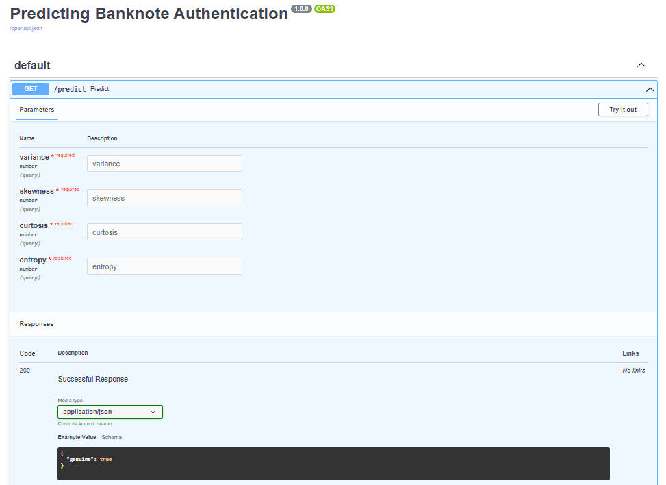

# Predicting Banknote Authentication

💵 Machine learning model to predict if a banknote is genuine or not.



## Context

This project is adapted from a [practice activity](./docs/problem_statement.pdf) of [IGTI's Machine Learning Engineer Bootcamp](https://www.igti.com.br/bootcamp/engenheiro-de-machine-learning), which was about analyze a [Banknote Authentication Dataset](https://archive.ics.uci.edu/ml/datasets/banknote+authentication) and building a Machine Learning classification model to predict if a banknote is genuine or not.

Besides the proposed activity, was developed an REST API to execute trained model with dynamic parameters, simulating a real world scenario where predictions should be accessible on real time.

## Project structure

Project structure consists in following components:

    .
    ├── api                   # Rest API files
    ├── docs                  # Documentation files
    ├── jupyter               # Jupyter environment with default notebooks
    ├── docker-compose.yml    # Environment start-up specification
    └── README.md             

## Reproducing environment

The [Docker Compose file](./docker-compose.yml) is configured to setup a Jupyter environment to perform data analysis and start REST API. So, considering you have it installed in your machine, all you need is run the following commands in a terminal window:

1. Clone repository:

```
$ git clone https://github.com/lucasfusinato/predicting-banknote-authentication
```

2. Open project's folder:

```
$ cd predicting-banknote-authentication
```

3. Start containers:

```
$ docker-compose up -d
```

And that's all! Now, you should be able to access API by clicking [here](http://localhost:8000/docs) and Jupyter Server on [this link](http://localhost:8888?token=9ecbffa3-5eaa-45d8-9bab-cc7d963e15e3).

## Built with

- [Docker Compose](https://docs.docker.com/compose/): Docker container's run specification tool which prepares Jupyter environment;
- [FastAPI](https://fastapi.tiangolo.com/): back-end API framwork;
- [Jupyter](https://jupyter.org/): notebook execution environment;
- [Pandas](https://pandas.pydata.org/): Python data analysis' package;
- [Scikit Learn](https://scikit-learn.org/stable/): Python machine learning's package.
